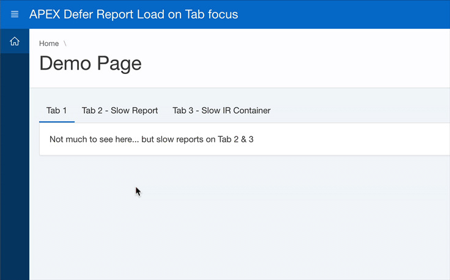

# Defer an APEX Report Load on Tab focus



This Dynamic Action plugin is meant to be used for slow reports that run under a tab container. Put another way, for reports that are not visible right away. <br>
It defers the load a of an IR or Classic report until the tab gets focused.  In reality the report does run, but it should use a "trigger" item set to N the first time it loads.  Then, the DA will switch the item to Y when the tab receives focus and refresh report and load the data.


## Demo App

Live Demo [apex.oracle.com/pls/apex/f?p=148571](https://apex.oracle.com/pls/apex/f?p=148571)

Install Demo App [f120.sql](apex/f120.sql)

## How To Use

* Create a hidden unprotected Page Item that you will use on your report and default it to "N". For example `P2_VISIBLE_TAB_IND`
* Use the item in your report and remember to add it to "Page Items to Submit". 
```sql
where nvl(:P2_VISIBLE_TAB_IND, 'N') = 'N'
```
* Create a "Page Load" Dynamic Action
* Use "Defer Report Load on Tab focus [Plug-In]" as the true action.
* Specify your Report as the Affected Element
* Specify the page item that will be switched from "N" to "Y" when the report refreshes (ie. P2_VISIBLE_TAB_IND).
* When the Tab becomes visible, the item will be set to Y and the report will refresh.
